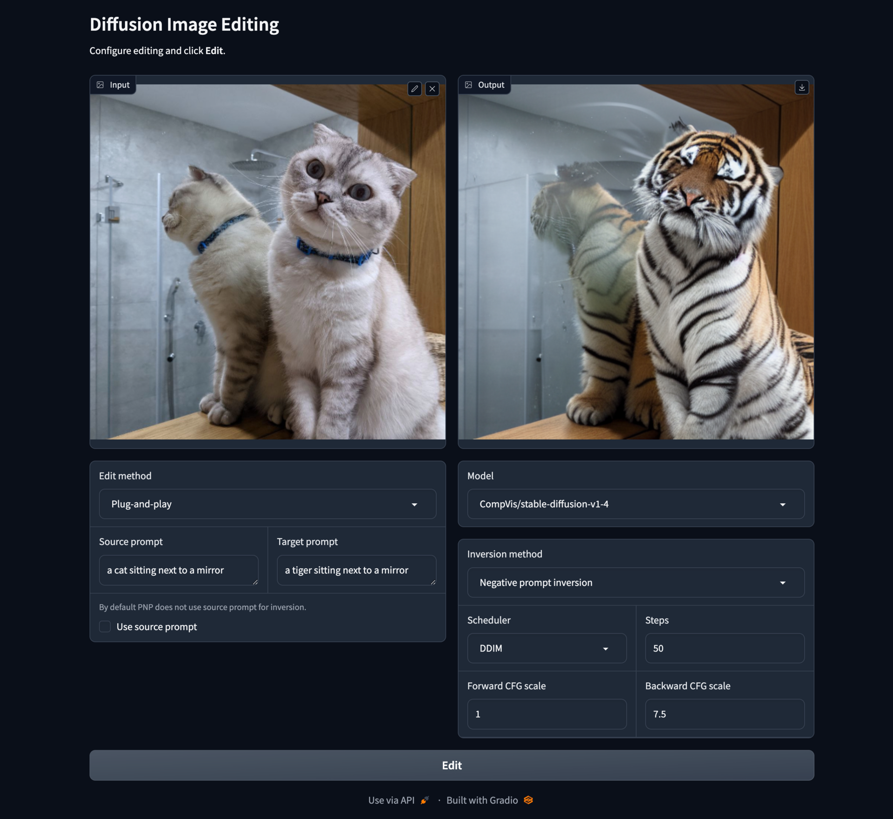

# diffusion-inversion-editing-benchmark

## Usage

- Note, we tested the code on a NVIDIA V100 32GB GPU. On different GPUs, results might slightly differ.

### Setup
- Install PyTorch (tested with Python 3.9 and PyTorch 1.13.1), e.g.,
  ```bash
  conda create -n diffinv python=3.9
  conda activate diffinv
  conda install pytorch==1.13.1 torchvision==0.14.1 torchaudio==0.13.1 pytorch-cuda=11.7 -c pytorch -c nvidia
  ```
- Install requirements
  ```bash
  pip install -r requirements.txt
  ```

### Demo

To run the provided Gradio demo run
```bash
python demo/run.py
```
and open `http://localhost:7860/` in your browser.



### Edit single image

To edit a single image, use `edit_image.py`.

```bash
python edit_image.py --help
usage: edit_image.py [-h] --input INPUT --source_prompt SOURCE_PROMPT --target_prompt TARGET_PROMPT [--output OUTPUT] [--inv_method INV_METHOD] [--edit_method EDIT_METHOD] [--edit_cfg EDIT_CFG] [--scheduler {ddim,ddpm,dpm}] [--steps STEPS] [--guidance_scale_bwd GUIDANCE_SCALE_BWD] [--guidance_scale_fwd GUIDANCE_SCALE_FWD]

Edits a single image.

optional arguments:
  -h, --help            show this help message and exit
  --input INPUT         Path to image to invert.
  --source_prompt SOURCE_PROMPT
                        Prompt to use for inversion.
  --target_prompt TARGET_PROMPT
                        Prompt to use for inversion.
  --output OUTPUT       Path for output image.
  --inv_method INV_METHOD
                        Available inversion methods:
                          diffinv                  Naiv DDIM inversion
                          nti                      Null text inversion
                          npi                      Negative prompt inversion
                          proxnpi                  Proximal negative prompt inversion
                          edict                    EDICT inversion
                          ddpminv                  DDPM inversion
                          dirinv                   Direct inversion
                          etainv                   Eta inversion
  --edit_method EDIT_METHOD
                        Available editing methods:
                          simple                   Simple denoising of inverted latent with target prompt
                          ptp                      Prompt-to-prompt
                          masactrl                 MasaControl
                          pnp                      Plug-and-play
                          pix2pix_zero             Pix2Pix zero
  --edit_cfg EDIT_CFG   Path to yaml file for editor configuration. Often needed for prompt-to-prompt.
  --scheduler {ddim,ddpm,dpm}
                        Which scheduler to use.
  --steps STEPS         How many diffusion steps to use.
  --guidance_scale_bwd GUIDANCE_SCALE_BWD
                        Classifier free guidance scale to use for backward diffusion (denoising).
  --guidance_scale_fwd GUIDANCE_SCALE_FWD
                        Classifier free guidance scale to use for forward diffusion (inversion).
  --prec {fp16,fp32}    Precision for diffusion.
```

E.g., for plug-and-play editing using simple ddim inversion of `test/data/gnochi_mirror_sq.png` with prompt `"a cat->tiger sitting next to a mirror"`, run
```bash
python edit_image.py \
  --inv_method etainv \
  --edit_method ptp \
  --input test/data/house.png \
  --source_prompt "a house in the woods" \
  --target_prompt "a monster in the woods" \
  --output out.png
```

| Input                                 | Output                                                |
| ------------------------------------- | ----------------------------------------------------- |
|  |   |


### Prepare datasets (for evaluation)
- [PIE](https://github.com/cure-lab/DirectInversion): Download from [here](https://github.com/cure-lab/DirectInversion#benchmark-download-%EF%B8%8F) and extract to `data/eval/PIE-Bench_v1`
- [Plug-and-Play](https://github.com/MichalGeyer/plug-and-play)
    - Download from [here](https://www.dropbox.com/sh/8giw0uhfekft47h/AAAF1frwakVsQocKczZZSX6La?dl=0) and extract to `data/eval/plug_and_play`
    - Run
      ```bash
      python scripts/convert_plug_and_play_imagenetr-ti2i.py
      python scripts/convert_plug_and_play_imagenetr-fake-ti2i.py
      ```
- [ImagenHub](https://tiger-ai-lab.github.io/ImagenHub/): No setup needed

### Evaluate

For evaluation prepare the dataset(s) above you want to test and create a config .yaml file inside `cfg/eval` with the datasets, inversion methods and editing methods you want to evaluate. For a reference config file see `cfg/eval/demo.yaml`. The evaluating script will run each combination given under `data`, `edit_method` and `method`. E.g., for the config file `cfg/eval/demo.yaml`, evaluation will run for `(diffinv, ptp)`, `(npi, ptp)` and `(etainv, ptp)`. After preparing the config .yaml file use

```bash
python eval.py --help
usage: eval.py [-h] --cfg CFG [CFG ...] [--device DEVICE [DEVICE ...]] [--no_proc]

Run evaluation for the given config file. The result will be stored under result/{cfg_file_name}. For each combination of dataset, inversion and editing method in the config file, a separate directory will be created in result/{cfg_file_name}

optional arguments:
  -h, --help            show this help message and exit
  --cfg CFG [CFG ...]   Config file(s) for evaluation.
  --device DEVICE [DEVICE ...]
                        Which cuda devices to use. Can be multiple (multiprocessing).
  --no_proc             Disables multiprocessing.
```

to perform editing and save all images under `result/{cfg_file_name}`. E.g., if you want to use `cfg/eval/demo.yaml` with one GPU, run

```bash
python eval.py --cfg cfg/eval/demo.yaml
```
All images will be stored under `result/demo`.

Afterwards you can compute metrics on the output images using
```bash
python compute_metrics.py --help
usage: compute_metrics.py [-h] [--cfg CFG [CFG ...]] [--metric METRIC [METRIC ...]]

optional arguments:
  -h, --help            show this help message and exit
  --cfg CFG [CFG ...]   Config file(s) for evaluation.
  --metric METRIC [METRIC ...]
                        Metric(s) to compute. If not specified, all metrics are computed.
```
The metrics will be stored as .yaml file in a folder named `metrics` under each experiment directory. E.g., to compute metrics for `cfg/eval/demo.yaml` run
```bash
python compute_metrics.py --cfg cfg/eval/demo.yaml
```

Finally you can visualize the computed metrics with [notebooks/visualize_results.ipynb](notebooks/visualize_results.ipynb). Please see the notebook for further details. 
