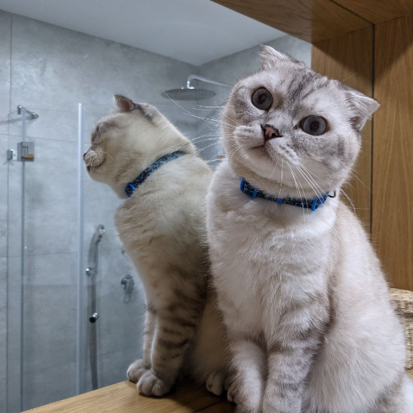
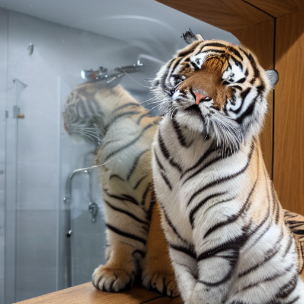
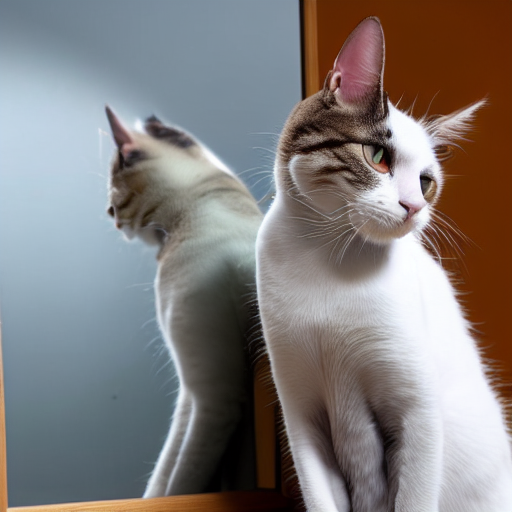

# diffusion-inversion-editing-benchmark

A PyTorch implementation of diffusion inversion & editing benchmark

## TODO :memo:
- [ ] Release technical report
- [ ] Release full code
- [ ] Release benchmark results
- [ ] Release document

## Table of Contents

- [diffusion-inversion-editing-benchmark](#diffusion-inversion-editing-benchmark)
  - [TODO :memo:](#todo-memo)
  - [Table of Contents](#table-of-contents)
  - [Supported Features](#supported-features)
    - [Schedulers](#schedulers)
    - [Datasets](#datasets)
    - [Methods](#methods)
    - [Metrics](#metrics)
  - [Usage](#usage)
  - [Related Papers](#related-papers)
  - [Evaluation Settings (Previous Works)](#evaluation-settings-previous-works)
    - [Editing](#editing)
  - [Inversion Benchmark (Ours)](#inversion-benchmark-ours)
  - [Editing Benchmark (Ours)](#editing-benchmark-ours)
  - [Generalized Framework for Inversion](#generalized-framework-for-inversion)
    - [Step 1](#step-1)
    - [Step 2](#step-2)
  - [License](#license)
  - [Citation](#citation)


## Supported Features

### Schedulers
- [x] [DDIM](#ddim)
- [x] [DPM-Solver](#dpm-solver)


### Datasets

<details><summary> <strong> Real </strong> </summary>

- [x] [ImageNet-R-TI2I](/docs/pnp.md#datasets)
- [ ] [Wild-TI2I](/docs/pnp.md#datasets)
- [ ] [PIE-Bench]()
</details>

<details><summary> <strong> Generated </strong> </summary>

- [x] [Prompt-to-Prompt dataset](/docs/ptp.md#datasets)
- [x] [ImageNet-R-fake-TI2I](/docs/pnp.md#datasets)
- [ ] [Wild-fake-TI2I](/docs/pnp.md#datasets)
- [ ] [InstructPix2Pix dataset](/docs/ip2p.md#datasets)
</details>


### Methods

<details><summary> <strong> Inversion </strong> </summary>

- [x] [DDIM Inversion](docs/ddim.md)
- [x] [NTI](docs/nti.md)
- [x] [NPI](docs/npi.md)
- [x] [ProxNPI](docs/proxnpi.md)
- [x] [Edit Friendly DDPM Inversion](docs/ddpminv.md)
- [x] [CycleDiffusion](docs/cyclediff.md)
- [x] [EDICT](docs/edict.md)
- [ ] [BDIA](docs/bdia.md)
- [ ] [StyleDiffusion](docs/stylediff.md)
- [ ] [AIDI](docs/aidi.md)
</details>

<details><summary> <strong> Editing </strong> </summary>

- [x] [default](docs/ldm.md)
- [x] [Prompt-to-Prompt](docs/ptp.md)
- [x] [Plug-and-Play](docs/pnp.md)
- [x] [MasaCtrl](docs/proxnpi.md)
- [ ] [~~InstructPix2Pix~~](docs/ip2p.md)[^1]
- [ ] [pix2pix-zero](docs/p2p-zero.md)
- [ ] [DDS](docs/dds.md)
</details>

[^1]: InstructPix2Pix is a variation of Stable Diffusion, not an editing method for Stable Diffusion.

### Metrics

<details><summary> <strong> Inversion </strong> </summary>

- [x] [MSE](/docs/metrics.md#mean-squared-error-mse)
- [x] [PSNR](/docs/metrics.md#peak-signal-to-noise-ratio-psnr)
- [x] [LPIPS](/docs/metrics.md#learned-perceptual-image-patch-similarity-lpips)
- [ ] [SSIM](/docs/metrics.md#structural-similarity-index-measure-ssim)
<!--
- [ ] [~~FID~~](/docs/metrics.md#fréchet-inception-distance-fid)
-->
</details>

<details><summary> <strong> Editing </strong> </summary>
  
- [x] CLIP similarity
  - [x] [Text<sub>tar</sub> - Image<sub>tar</sub>](/docs/metrics.md#texttar---imagetar-clip-similarity)
  - [ ] [Image<sub>src</sub> - Image<sub>tar</sub>](/docs/metrics.md#imagesrc---imagetar-clip-similarity)
  - [x] [Text<sub>tar</sub> - caption from BLIP(Image<sub>tar</sub>)](/docs/metrics.md#texttar---caption-from-blipimagetar-clip-similarity)
- [x] [directional CLIP similarity](/docs/metrics.md#directional-clip-similarity)
- [x] [CLIP accuracy](/docs/metrics.md#clip-accuracy)
- [x] [DINO](/docs/pnp.md#metrics)
- [x] [DINOv2](https://github.com/facebookresearch/dinov2)
- [x] [LPIPS](/docs/metrics.md#lpips)
- [x] [NS-LPIPS](/docs/metrics.md#ns-lpips)
- [ ] [BG-LPIPS](/docs/metrics.md#bg-lpips)
- [ ] [MS-SSIM](https://github.com/VainF/pytorch-msssim)
- [ ] [~~FID~~](/docs/metrics.md#fréchet-inception-distance-fid)[^2]
<!--
- [x] BLIP accuracy
-->

</details>

[^2]: FID is only useful for unpaired image-to-image translation.


## Usage

### Setup
- Install PyTorch (tested with Python 3.9 and PyTorch 1.13.1)
- Install requirements
  ```bash
  pip install -r requirements.txt
  ```

### Prepare datasets (for evaluation)
- [Plug-and-Play](https://github.com/MichalGeyer/plug-and-play)
    - Download from [here](https://www.dropbox.com/sh/8giw0uhfekft47h/AAAF1frwakVsQocKczZZSX6La?dl=0) and extract to `data/eval/plug_and_play`
    - Run
      ```bash
      python scripts/convert_plug_and_play_imagenetr-ti2i.py
      python scripts/convert_plug_and_play_imagenetr-fake-ti2i.py
      ```
- [ImagenHub](https://tiger-ai-lab.github.io/ImagenHub/): No setup needed
- [PIE](https://github.com/cure-lab/DirectInversion): Download from [here](https://github.com/cure-lab/DirectInversion#benchmark-download-%EF%B8%8F) and extract to `data/eval/PIE-Bench_v1`

### Run

<details open><summary><strong>Edit a single image</strong></summary>

To edit a single image, use `edit_image.py`.

```bash
python edit_image.py --help
usage: edit_image.py [-h] --input INPUT --src_prompt SRC_PROMPT --target_prompt TARGET_PROMPT [--output OUTPUT] [--inv_method INV_METHOD] [--edit_method EDIT_METHOD] [--edit_cfg EDIT_CFG] [--scheduler {ddim,ddpm,dpm}] [--steps STEPS] [--guidance_scale_bwd GUIDANCE_SCALE_BWD] [--guidance_scale_fwd GUIDANCE_SCALE_FWD]

Edits a single image.

optional arguments:
  -h, --help            show this help message and exit
  --input INPUT         Path to image to invert.
  --src_prompt SRC_PROMPT
                        Prompt to use for inversion.
  --target_prompt TARGET_PROMPT
                        Prompt to use for inversion.
  --output OUTPUT       Path for output image.
  --inv_method INV_METHOD
                        Available inversion methods:
                          diffinv                  Naiv DDIM inversion
                          nti                      Null text inversion
                          npi                      Negative prompt inversion
                          proxnpi                  Proximal negative prompt inversion
                          edict                    EDICT inversion
                          ddpminv                  DDPM inversion
  --edit_method EDIT_METHOD
                        Available editing methods:
                          simple                   Simple denoising of inverted latent with target prompt
                          ptp                      Prompt-to-prompt
                          masactrl                 MasaControl
                          pnp                      Plug-and-play
  --edit_cfg EDIT_CFG   Path to yaml file for editor configuration. Often needed for prompt-to-prompt.
  --scheduler {ddim,ddpm,dpm}
                        Which scheduler to use.
  --steps STEPS         How many diffusion steps to use.
  --guidance_scale_bwd GUIDANCE_SCALE_BWD
                        Classifier free guidance scale to use for backward diffusion (denoising).
  --guidance_scale_fwd GUIDANCE_SCALE_FWD
                        Classifier free guidance scale to use for forward diffusion (inversion).
```

E.g., for plug-and-play editing using simple ddim inversion of `test/data/gnochi_mirror_sq.png` with prompt `"a cat->tiger sitting next to a mirror"`, run
```bash
python edit_image.py \
  --inv_method diffinv \
  --edit_method pnp \
  --input data/demo/gnochi_mirror_sq.png \
  --src_prompt "a cat sitting next to a mirror" \
  --target_prompt "a tiger sitting next to a mirror" \
  --output out.png
```

| Input                                 | Output                                                |
| ------------------------------------- | ----------------------------------------------------- |
|  |   |

</details>

<details><summary><strong>Invert a single image</strong></summary>

To invert a single image, use `invert_image.py`.

```bash
python invert_image.py --help
usage: invert_image.py [-h] --input INPUT --prompt PROMPT [--output OUTPUT] [--method METHOD] [--scheduler {ddim,ddpm,dpm}] [--steps STEPS] [--guidance_scale_bwd GUIDANCE_SCALE_BWD] [--guidance_scale_fwd GUIDANCE_SCALE_FWD]

Inverts a single image.

optional arguments:
  -h, --help            show this help message and exit
  --input INPUT         Path to image to invert.
  --prompt PROMPT       Prompt to use for inversion.
  --output OUTPUT       Path for output image.
  --method METHOD       Available inversion methods:
                          diffinv                  Naiv DDIM inversion
                          nti                      Null text inversion
                          npi                      Negative prompt inversion
                          proxnpi                  Proximal negative prompt inversion
                          edict                    EDICT inversion
                          ddpminv                  DDPM inversion
  --scheduler {ddim,ddpm,dpm}
                        Which scheduler to use.
  --steps STEPS         How many diffusion steps to use.
  --guidance_scale_bwd GUIDANCE_SCALE_BWD
                        Classifier free guidance scale to use for backward diffusion (denoising).
  --guidance_scale_fwd GUIDANCE_SCALE_FWD
                        Classifier free guidance scale to use for forward diffusion (inversion).
```

E.g., for simple DDIM inversion of `test/data/gnochi_mirror_sq.png` with the prompt `"a cat sitting next to a mirror"`, run
```bash
python invert_image.py \
  --method diffinv \
  --input test/data/gnochi_mirror_sq.png \
  --prompt "a cat sitting next to a mirror" \
  --output out.png
```

| Input                                 | Output                                            |
| ------------------------------------- | ------------------------------------------------- |
|  |   |

</details>


<details><summary><strong>Evaluation</strong></summary>

For evaluation prepare the dataset(s) above you want to test and create a config .yaml file inside `cfg/eval` with the datasets, inversion methods and editing methods you want to evaluate. For a reference config file see `cfg/eval/demo.yaml`. The evaluating script will run each combination given under `data`, `edit_method` and `method`. E.g., for the config file `cfg/eval/demo.yaml`, evaluation will run for `(diffinv, simple)`, `(diffinv, ptp)`, `(npi, simple)` and `(npi, ptp)`. After preparing the config .yaml file use

```bash
python eval.py --help
usage: eval.py [-h] --cfg CFG [CFG ...] [--device DEVICE [DEVICE ...]] [--no_proc]

Run evaluation for the given config file. The result will be stored under result/{cfg_file_name}. For each combination of dataset, inversion and editing method in the config file, a separate directory will be created in result/{cfg_file_name}

optional arguments:
  -h, --help            show this help message and exit
  --cfg CFG [CFG ...]   Config file(s) for evaluation.
  --device DEVICE [DEVICE ...]
                        Which cuda devices to use. Can be multiple (multiprocessing).
  --no_proc             Disables multiprocessing.
```

to perform editing and save all images under `result/{cfg_file_name}`. E.g., if you want to use `cfg/eval/demo.yaml` with one GPU, run

```bash
python eval.py --cfg cfg/eval/demo.yaml
```
All images will be stored under `result/demo`.

Afterwards you can compute metrics on the output images using
```bash
python compute_metrics.py --help
usage: compute_metrics.py [-h] [--cfg CFG [CFG ...]] [--metric METRIC [METRIC ...]]

optional arguments:
  -h, --help            show this help message and exit
  --cfg CFG [CFG ...]   Config file(s) for evaluation.
  --metric METRIC [METRIC ...]
                        Metric(s) to compute. If not specified, all metrics are computed.
```
The metrics will be stored as .yaml file in a folder named `metrics` under each experiment directory. E.g., to compute metrics for `cfg/eval/demo.yaml` run
```bash
python compute_metrics.py --cfg cfg/eval/demo.yaml
```

Finally you can visualize the computed metrics with [notebooks/visualize_results.ipynb](notebooks/visualize_results.ipynb). Please see the notebook for further details. 

</details>

### Demo

To run the provided Gradio demo run
```bash
python demo/run.py
```
and open `http://localhost:7860/` in your browser.


## Related Papers

<details><summary> <h3> Generation </h3> </summary>

**High-Resolution Image Synthesis with Latent Diffusion Models (CVPR 2022)** <a id='ldm'></a> <br>
[[arXiv](https://arxiv.org/abs/2112.10752)] [[Github](https://github.com/CompVis/stable-diffusion)] [[Project](https://ommer-lab.com/research/latent-diffusion-models/)]

**Denoising Diffusion Implicit Models (ICLR 2021)** <a id='ddim'></a> <br>
[[arXiv](https://arxiv.org/abs/2010.02502)] [[Github](https://github.com/ermongroup/ddim)]

**DPM-Solver: A Fast ODE Solver for Diffusion Probabilistic Model Sampling in Around 10 Steps (NeurIPS 2022)** <a id='dpm-solver'></a> <br>
[[arXiv](https://arxiv.org/abs/2206.00927)] [[Github](https://github.com/LuChengTHU/dpm-solver)]

**DPM-Solver++: Fast Solver for Guided Sampling of Diffusion Probabilistic Models (arXiv 2022)** <a id='dpm-solver++'></a> <br>
[[arXiv](https://arxiv.org/abs/2211.01095)] [[Github](https://github.com/LuChengTHU/dpm-solver)]

</details>

<details><summary> <h3> Inversion </h3> </summary>

**Null-text Inversion for Editing Real Images using Guided Diffusion Models (CVPR 2023)** <a id='nti'></a> <br>
[[Summary](/docs/nti.md)] [[arXiv](https://arxiv.org/abs/2211.09794)] [[Github](https://github.com/google/prompt-to-prompt/#null-text-inversion-for-editing-real-images)] [[Project](https://null-text-inversion.github.io/)]

**Negative-prompt Inversion: Fast Image Inversion for Editing with Text-guided Diffusion Models (arXiv 2023)** <a id='npi'></a> <br>
[[Summary](/docs/npi.md)] [[arXiv](https://arxiv.org/abs/2305.16807)]

**Improving Tuning-Free Real Image Editing with Proximal Guidance (arXiv 2023)** <a id='proxnpi'></a> <br>
[[Summary](/docs/proxnpi.md)] [[arXiv](https://arxiv.org/abs/2306.05414)] [[Github](https://github.com/phymhan/prompt-to-prompt)]

**An Edit Friendly DDPM Noise Space: Inversion and Manipulations (arXiv 2023)** <a id='ddpminv'></a> <br>
[[Summary](/docs/ddpminv.md)] [[arXiv](https://arxiv.org/abs/2304.06140)] [[Github](https://github.com/inbarhub/DDPM_inversion)] [[Project](https://inbarhub.github.io/DDPM_inversion/)]

**Unifying Diffusion Models' Latent Space, with Applications to CycleDiffusion and Guidance (ICCV 2023)** <a id='cyclediff'></a> <br>
[[Summary](/docs/cyclediff.md)] [[arXiv](https://arxiv.org/abs/2210.05559)] [[Github](https://github.com/ChenWu98/cycle-diffusion)]

**EDICT: Exact Diffusion Inversion via Coupled Transformations (CVPR 2023)** <a id='edict'></a> <br>
[[Summary](/docs/edict.md)] [[arXiv](https://arxiv.org/abs/2307.10829)] [[Github](https://github.com/salesforce/EDICT)]

**Exact Diffusion Inversion via Bi-directional Integration Approximation (arXiv 2023)** <a id='bdia'></a> <br>
[[Summary](/docs/bdia.md)] [[arXiv](https://arxiv.org/abs/2211.12446)] [[Github](https://github.com/guoqiang-zhang-x/BDIA)]

**StyleDiffusion: Prompt-Embedding Inversion for Text-Based Editing (arXiv 2023)** <a id='stylediff'></a> <br>
[[Summary](/docs/stylediff.md)] [[arXiv](https://arxiv.org/abs/2303.15649)] [[Github](https://github.com/sen-mao/StyleDiffusion)]

**Effective Real Image Editing with Accelerated Iterative Diffusion Inversion (ICCV 2023)** <a id='aidi'></a> <br>
[[Summary](/docs/aidi.md)] [[arXiv](https://arxiv.org/abs/2309.04907)]

**FEC: Three Finetuning-free Methods to Enhance Consistency for Real Image Editing (arXiv 2023)** <a id='fec'></a> <br>
[[Summary](/docs/fec.md)] [[arXiv](https://arxiv.org/abs/2309.14934)]

**KV Inversion: KV Embeddings Learning for Text-Conditioned Real Image Action Editing (arXiv 2023)** <a id='kvinv'></a> <br>
[[Summary](/docs/fec.md)] [[arXiv](https://arxiv.org/abs/2309.16608)]

**Direct Inversion: Boosting Diffusion-based Editing with 3 Lines of Code (arXiv 2023)** <a id='directinv'></a> <br>
[[Summary](/docs/directinv.md)] [[arXiv](https://arxiv.org/abs/2310.01506)] [[Github](https://github.com/cure-lab/DirectInversion)]

</details>

<details><summary> <h3> Editing </h3> </summary>

**Prompt-to-Prompt Image Editing with Cross Attention Control (ICLR 2023)** <a id='ptp'></a> <br>
[[Summary](/docs/ptp.md)] [[arXiv](https://arxiv.org/abs/2208.01626)] [[Github](https://github.com/MichalGeyer/plug-and-play)] [[Project](https://prompt-to-prompt.github.io/)]

**Plug-and-Play Diffusion Features for Text-Driven Image-to-Image Translation (CVPR 2023)** <a id='pnp'></a> <br>
[[Summary](/docs/pnp.md)] [[arXiv](https://arxiv.org/abs/2211.12572)] [[Github](https://github.com/MichalGeyer/plug-and-play)] [[Project](https://pnp-diffusion.github.io/)]


**MasaCtrl: Tuning-Free Mutual Self-Attention Control for Consistent Image Synthesis and Editing (ICCV 2023)** <a id='masactrl'></a> <br>
[[Summary](/docs/masactrl.md)] [[arXiv](https://arxiv.org/abs/2304.08465)] [[Github](https://github.com/TencentARC/MasaCtrl)] [[Project](https://ljzycmd.github.io/projects/MasaCtrl/)]

**InstructPix2Pix: Learning to Follow Image Editing Instructions (CVPR 2023)** <a id='ip2p'></a> <br>
[[Summary](/docs/ip2p.md)] [[arXiv](https://arxiv.org/abs/2211.09800)] [[Github](https://www.timothybrooks.com/instruct-pix2pix)] [[Project](https://github.com/timothybrooks/instruct-pix2pix)]

**Zero-shot Image-to-Image Translation (SIGGRAPH 2023)** <a id='p2p-zero'></a> <br>
[[Summary](/docs/p2p-zero.md)] [[arXiv](https://arxiv.org/abs/2302.03027)] [[Github](https://github.com/pix2pixzero/pix2pix-zero)] [[Project](https://pix2pixzero.github.io)]

**Delta Denoising Score (arXiv 2023)** <a id='dds'></a> <br>
[[Summary](/docs/dds.md)] [[arXiv](https://arxiv.org/abs/2304.07090)] [[Project](https://delta-denoising-score.github.io)]

</details>

## Evaluation Settings (Previous Works)

### Editing

<details><summary> <strong> Methods / Datasets </strong> </summary>

|                                      | ImageNet-R-TI2I     | Wild-TI2I          	| Prompt-to-Prompt  	|ImageNet-R-fake-TI2I	| Wild-fake-TI2I     	| Private /  Custom   |  
|-------------------------------       |:------------------:	|:------------------:	|:------------------:	|:------------------:	|:------------------:	|:------------------:	|
| [NTI](docs/nti.md)      	           |                    	|                    	|                    	|                    	|                    	|                    	|                    	|                    	|                    	|                    	|                   	|
| [NPI](docs/npi.md)      	           |                    	|                    	|                    	|                    	|                    	|                    	|                    	|                    	|                    	|                    	|                    	|
| [ProxNPI](docs/proxnpi.md)           |                    	|                    	|                    	|                    	|                    	|                    	|                    	|                    	|                    	|                    	|                    	|
| [edit friendly DDPM](docs/ddpminv.md)|                    	|                    	|                    	|                    	|                    	|                    	|                    	|                    	|                    	|                    	|                    	|
| [CycleDiffusion](docs/cyclediff.md)  |                    	|                    	|                   	|                    	|                     |                    	|                    	|                    	|                    	|                    	|                    	|
| [EDICT](docs/edict.md)               |                    	|                    	|                    	|                    	|                    	|                    	|                    	|                    	|                    	|                    	|                    	|
| [BDIA](docs/bdia.md)    	           |                    	|                    	|                    	|                    	|                    	|                    	|                    	|                    	|                    	|                    	|                    	|
| [StyleDiffusion](docs/stylediff.md)  |                    	|                    	|                    	|                    	|                    	|                    	|                    	|                    	|                    	|                    	|                    	|
| [AIDI](docs/aidi.md)                 |                    	|                    	|                    	|                    	|                    	|                   	|                    	|                    	|                   	|                    	|                    	|
| [Prompt-to-Prompt](docs/ptp.md) 	   |                    	|                    	|                    	|                    	|                    	|                    	|                    	|                    	|                    	|                    	|                   	|
| [Plug-and-Play](docs/pnp.md)         |                    	|                    	|                    	|                    	|                    	|                    	|                    	|                    	|                    	|                    	|                    	|
| [MasaCtrl](docs/masactrl.md)         |                    	|                    	|                    	|                    	|                    	|                    	|                    	|                    	|                    	|                    	|                    	|
| [InstructPix2Pix](docs/ip2p.md) 	   |                    	|                    	|                    	|                    	|                    	|                    	|                    	|                    	|                    	|                    	|                    	|
| [pix2pix-zero](docs/p2p-zero.md)     |                    	|                    	|                    	|                    	|                    	|                    	|                    	|                    	|                    	|                   	|                    	|
| [DDS](docs/dds.md)                   |                    	|                    	|                    	|                    	|                    	|                    	|                    	|                    	|                    	|                   	|                    	|

</details>

<br>

<details><summary> <strong> Methods / Metrics </strong> </summary>

<!--
| Methods \ Metrics                    | CLIP(1)              | CLIP(2)            	| CLIP(3)            	| CLIP(4)            	| CLIP(5)            	| DINO               	| DINOv2             	| LPIPS              	| NS-LPIPS           	| BG-LPIPS           	| MS-SSIM           	|
-->

|                                      | [CLIP(1)](docs/metrics.md#texttar---imagetar-clip-similarity)| [CLIP(2)](docs/metrics.md#imagesrc---imagetar-clip-similarity)| [CLIP(3)](docs/metrics.md#texttar---caption-from-blipimagetar-clip-similarity)| [CLIP(4)](docs/metrics.md#directional-clip-similarity)| [CLIP(5)](docs/metrics.md#clip-accuracy)            	| DINO               	| DINOv2             	| LPIPS              	| [NS-LPIPS](/docs/metrics.md#ns-lpips)| [BG-LPIPS](/docs/metrics.md#bg-lpips)| [MS-SSIM](/docs/metrics#ms-ssim)|
|--------------------------------------|:-------------------: |:------------------:	|:------------------:	|:------------------:	|:------------------:	|:------------------:	|:------------------:	|:------------------:	|:------------------:	|:------------------:	|:------------------:	|
| [NTI](docs/nti.md)       	           | :heavy_check_mark: 	|                    	|                    	|                    	|                    	|                    	|                    	| :heavy_check_mark:	|                    	|                    	|                   	|
| [NPI](docs/npi.md)       	           |                    	|                    	|                    	|                    	|                    	|                    	|                    	|                    	|                    	|                    	|                    	|
| [ProxNPI](docs/proxnpi.md)           |                    	|                    	|                    	|                    	|                    	|                    	|                    	|                    	|                    	|                    	|                    	|
| [edit friendly DDPM](docs/ddpminv.md)| :heavy_check_mark: 	|                    	|                    	|                    	|                    	|                    	|                    	| :heavy_check_mark:	|                    	|                    	|                    	|
| [CycleDiffusion](docs/cyclediff.md)  | :heavy_check_mark: 	|                    	|                   	| :heavy_check_mark:	|                    	|                    	|                    	|                    	|                    	|                    	|                    	|
| [EDICT](docs/edict.md)               |                    	|                    	|                    	|                    	|                    	|                    	|                    	|                    	|                    	|                    	|                    	|
| [BDIA](docs/bdia.md)    	           |                    	|                    	|                    	|                    	|                    	|                    	|                    	|                    	|                    	|                    	|                    	|
| [StyleDiffusion](docs/stylediff.md)  | :heavy_check_mark:	  |                    	|                    	|                    	|                    	| :heavy_check_mark: 	|                    	|                    	| :heavy_check_mark: 	|                    	|                    	|
| [AIDI](docs/aidi.md)                 |                    	|                    	|                    	|                    	|                    	|                   	|                    	| :heavy_check_mark: 	|                   	|                    	|                    	|
| [Prompt-to-Prompt](docs/ptp.md) 	   | :heavy_check_mark: 	|                    	|                    	|                    	|                    	|                    	|                    	| :heavy_check_mark:	|                    	|                    	| :heavy_check_mark:	|
| [Plug-and-Play](docs/pnp.md)         | :heavy_check_mark: 	|                    	|                    	|                    	|                    	| :heavy_check_mark: 	|                    	|                    	|                    	|                    	|                    	|
| [MasaCtrl](docs/masactrl.md)         |                    	|                    	|                    	|                    	|                    	|                    	|                    	|                    	|                    	|                    	|                    	|
| [InstructPix2Pix](docs/ip2p.md)  	   |                    	| :heavy_check_mark:  |                    	| :heavy_check_mark: 	|                    	|                    	|                    	|                    	|                    	|                    	|                    	|
| [pix2pix-zero](docs/p2p-zero.md)     |                    	|                    	|                    	|                    	| :heavy_check_mark:	| :heavy_check_mark:	|                    	|                    	|                    	| :heavy_check_mark:	|                    	|
| [DDS](docs/dds.md)                   |                    	|                    	|                    	|                    	|                    	|                    	|                    	|                    	|                    	|                   	|                    	|

</details>

## Inversion Benchmark (Ours)

## Editing Benchmark (Ours)

<details><summary> <h3> ImageNet-R-fake-TI2I </h3> </summary>

<details><summary> <strong> default </strong> </summary>

|                    | CLIP (1) | CLIP (2) | CLIP (3) | CLIP (4) | CLIP (5) | DINO     | DINOv2   | LPIPS    | NS-LPIPS |
| ------------------ | -------- | -------- | -------- | -------- | -------- | -------- | -------- | -------- | -------- |
| DDIM Inversion     | 0.341766 |          | 0.736218 | 0.221886 | 0.877778 | 0.070514 | 0.010125 | 0.487593 | 0.448428 |
| NTI                | 0.343606 |          | 0.743542 | 0.235385 | 0.966667 | 0.09495  | 0.012937 | 0.627211 | 0.583838 |
| NPI                | 0.340476 |          | 0.734226 | 0.24395  | 1        | 0.099701 | 0.013611 | 0.624828 | 0.578814 |
| ProxNPI            | 0.315899 |          | 0.703899 | 0.100557 | 0.255556 | 0.012582 | 0.00265  | 0.09585  | 0.086636 |
| edit friendly DDPM | 0.331042 |          | 0.719247 | 0.17686  | 0.522222 | 0.022227 | 0.005257 | 0.226063 | 0.206924 |
| CycleDiffusion     | 0.337228 |          | 0.749095 | 0.187627 | 0.688889 | 0.047049 | 0.00784  | 0.318479 | 0.292858 |
| EDICT              | 0.315789 |          | 0.715312 | 0.129871 | 0.377778 | 0.020153 | 0.004519 | 0.173052 | 0.155117 |

</details>

<br>

<details><summary> <strong> Prompt-to-Prompt </strong> </summary>

|                    | CLIP (1) | CLIP (2) | CLIP (3) | CLIP (4) | CLIP (5) | DINO     | DINOv2   | LPIPS    | NS-LPIPS |
| ------------------ | -------- | -------- | -------- | -------- | -------- | -------- | -------- | -------- | -------- |
| DDIM Inversion     | 0.311073 |          | 0.700047 | 0.072672 | 0.166667 | 0.04123  | 0.006968 | 0.340882 | 0.309382 |
| NTI                | 0.318859 |          | 0.718193 | 0.138292 | 0.455556 | 0.017783 | 0.004223 | 0.190477 | 0.170184 |
| NPI                | 0.315553 |          | 0.706541 | 0.150239 | 0.455556 | 0.019579 | 0.004375 | 0.186401 | 0.16616  |
| ProxNPI            | 0.313578 |          | 0.706885 | 0.129105 | 0.377778 | 0.010481 | 0.002977 | 0.111286 | 0.097468 |
| edit friendly DDPM | 0.313545 |          | 0.706514 | 0.120553 | 0.255556 | 0.009762 | 0.003245 | 0.133627 | 0.120796 |
| CycleDiffusion     | 0.308832 |          | 0.704135 | 0.068586 | 0.111111 | 0.004727 | 0.001802 | 0.064876 | 0.056243 |
| EDICT              |          |          |          |          |          |          |          |          |          |

</details>

<br>

<details><summary> <strong> Plug-and-Play </strong> </summary>

|                    | CLIP (1) | CLIP (2) | CLIP (3) | CLIP (4) | CLIP (5) | DINO     | DINOv2   | LPIPS    | NS-LPIPS |
| ------------------ | -------- | -------- | -------- | -------- | -------- | -------- | -------- | -------- | -------- |
| DDIM Inversion     | 0.314873 |          | 0.710257 | 0.131659 | 0.4      | 0.016076 | 0.004054 | 0.215915 | 0.196314 |
| NTI                | 0.321314 |          | 0.731853 | 0.140107 | 0.411111 | 0.01511  | 0.004141 | 0.20549  | 0.186483 |
| NPI                | 0.320423 |          | 0.732052 | 0.136423 | 0.355556 | 0.01541  | 0.004153 | 0.204655 | 0.18533  |
| ProxNPI            | 0.303496 |          | 0.70115  | 0.04162  | 0.066667 | 0.00267  | 0.001174 | 0.044609 | 0.039883 |
| edit friendly DDPM | 0.319387 |          | 0.716365 | 0.136479 | 0.344444 | 0.013327 | 0.004038 | 0.164161 | 0.150024 |
| CycleDiffusion     |          |          |          |          |          |          |          |          |          |
| EDICT              |          |          |          |          |          |          |          |          |          |

</details>

<br>

<details><summary> <strong> MasaCtrl</strong> </summary>

|                    | CLIP (1) | CLIP (2) | CLIP (3) | CLIP (4) | CLIP (5) | DINO     | DINOv2   | LPIPS    | NS-LPIPS |
| ------------------ | -------- | -------- | -------- | -------- | -------- | -------- | -------- | -------- | -------- |
| DDIM Inversion     | 0.308089 |          | 0.701601 | 0.047584 | 0.1      | 0.023901 | 0.004708 | 0.172837 | 0.155463 |
| NTI                | 0.308169 |          | 0.706029 | 0.045581 | 0.077778 | 0.021672 | 0.004288 | 0.156994 | 0.14113  |
| NPI                | 0.311534 |          | 0.703379 | 0.053731 | 0.122222 | 0.033282 | 0.00575  | 0.204528 | 0.185332 |
| ProxNPI            | 0.306849 |          | 0.708506 | 0.028574 | 0.1      | 0.024338 | 0.004344 | 0.149146 | 0.13474  |
| edit friendly DDPM | 0.309934 |          | 0.704331 | 0.083397 | 0.211111 | 0.00966  | 0.002992 | 0.106611 | 0.096742 |
| CycleDiffusion     | 0.31088  |          | 0.697258 | 0.084274 | 0.188889 | 0.015798 | 0.003556 | 0.124873 | 0.112162 |
| EDICT              |          |          |          |          |          |          |          |          |          |

</details>

</details>


<details><summary> <h3> ImageNet-R-TI2I </h3> </summary>

<details><summary> <strong> default </strong> </summary>


</details>

<br>

<details><summary> <strong> Prompt-to-Prompt </strong> </summary>


</details>

<br>

<details><summary> <strong> Plug-and-Play </strong> </summary>


</details>

<br>

<details><summary> <strong> MasaCtrl</strong> </summary>


</details>

</details>


<details><summary> <h3> Prompt-to-Prompt dataset </h3> </summary>

<details><summary> <strong> default </strong> </summary>


</details>

<br>

<details><summary> <strong> Prompt-to-Prompt </strong> </summary>


</details>

<br>

<details><summary> <strong> Plug-and-Play </strong> </summary>


</details>

<br>

<details><summary> <strong> MasaCtrl</strong> </summary>


</details>

</details>


## Generalized Framework for Inversion

### Step 1

### Step 2

## Setup
```
pip install -r requirements.txt
```

## License

## Citation
Please cite our work if you use this code.