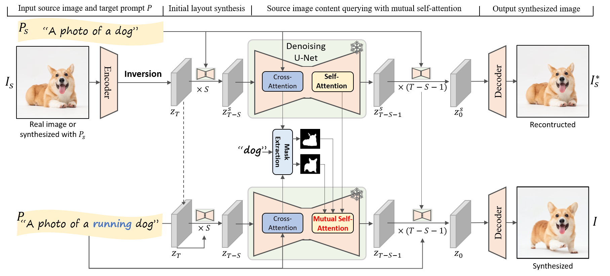

# MasaCtrl: Tuning-Free Mutual Self-Attention Control for Consistent Image Synthesis and Editing (ICCV 2023)
[[arXiv](https://arxiv.org/abs/2304.08465)] [[Github](https://github.com/TencentARC/MasaCtrl)] [[Project](https://ljzycmd.github.io/projects/MasaCtrl/)]

## Datasets 

**None**

## Methods 

## Metrics 

**None**