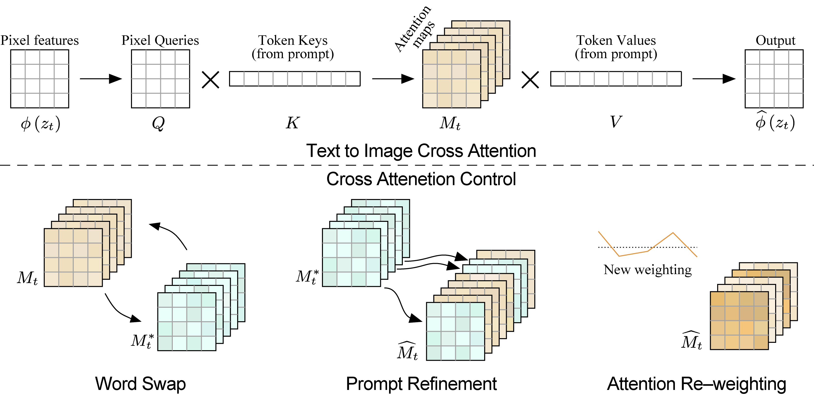

# Prompt-to-Prompt Image Editing with Cross Attention Control (ICLR 2023)
[[arXiv](https://arxiv.org/abs/2208.01626)] [[Github](https://github.com/MichalGeyer/plug-and-play)] [[Project](https://prompt-to-prompt.github.io/)]
## Datasets 

>We use the following prompt templates to generate the evaluation data:
>
>>Template_1: "Image of <A_RPC> inside a <B_CONST>."  
Select_A = ["apples", "oranges", "chocolates", "kittens", "puppies", "candies"]  
Select_B = ["box". "bowl", "bucket", "nest", "pot"]  
>
>>Template_2: "A <A_RPC> full of <B_CONST> is lying on the table."  
Select_A = ["box". "bowl", "bucket", "nest", "pot"]  
Select_B = ["apples", "oranges", "chocolates", "kittens", "puppies", "candies"]  
>
>>Template_3: "Photo of a <A_RPC> <B_CONST>."  
Select_A = ["cat", "dog", "lion", "camel", "horse", "bear", "squirrel", "elephant", "zebra", "giraffe", "cow"]  
Select_B = ["seating in the field", "walking in the field", "walking in the city", "wandering around the city", "wandering in the streets", "walking in the desert", "seating in the desert", "walking in the forest", "seating in the forest", "plays at the playground", "enjoys at the playground"]  
>
>>Template_4: "Photo of a <A_CONST> <B_ADD> with a <C_CONST> on it."  
Select_A = ["tree", "shrub", "flower", "chair", "fruit"]  
Select_B = ["made of candies", "made of bricks", "made of paper", "made of clay", "made of wax", "made of feathers"]  
Select_C = ["bug", "butterfly", "bee", "grasshopper", "bird"]  
>
>>Template_5: "Image of <A_ADD> <B_CONST> on the side of the road."  
Select_A = ["wooden", "old", "crashed", "golden", "silver", "sport", "toy"]  
Select_B = ["car", "bus", "bicycle", "motorcycle", "scooter", "van"]  
>
>>Template_6: "A landscape image of <A_CONST> <B_ADD>."  
Select_A = ["a river", "a lake", "a valley", "mountains", "a forest", "a river in the valley", "a village on a mountain", "a waterfall between the mountains", "the cliffs in the desert"]  
Select_B = ["in the winter", "in the autumn", "at night", "at sunset", "at sunrise", "at fall", "in rainy day", "in a cloudy day", "at evening"]  
>
>>Template_7: "<A_CONST> in the <B_ADD> street."
Select_A = ["Heavy traffic", "The houses", "The buildings", "Cycling", "The tram is passing", "The bus arrived at the station"]  
Select_B = ["snowy", "flooded", "blossom", "modern", "historic", "commercial", "colorful"]  
>
>We generate 20 random examples using each template where the tokens \<CONST>, <RPC> and <ADD> where randomly replaced with one item in the corresponding selection list below each template.
>>\<CONST> stands for phrase that is used in both source and target prompt.  
\<RPC> stands for phrase that is different between the source and target.  
\<ADD> stands for refinement phrase which is only replaced in the target prompt and omitted in the source prompt.

## Methods 

## Metrics 

**Texttar - Imagetar CLIP similarity**  
[[Github](https://github.com/OpenAI/CLIP)]

**LPIPS**

**MS-SSIM**

>We evaluate text-image correspondence using their CLIP score, demonstrating competitive results to methods that directly optimize this metric. In addition, we evaluate the perceptual similarity between the original and edited images using LPIPS and MS-SSIM. This shows our capability of performing local editing, similar to Text2Live. However, CLIP score and perceptual similarity do not reflect our superior quality and realism which are demonstrated in the user study.

