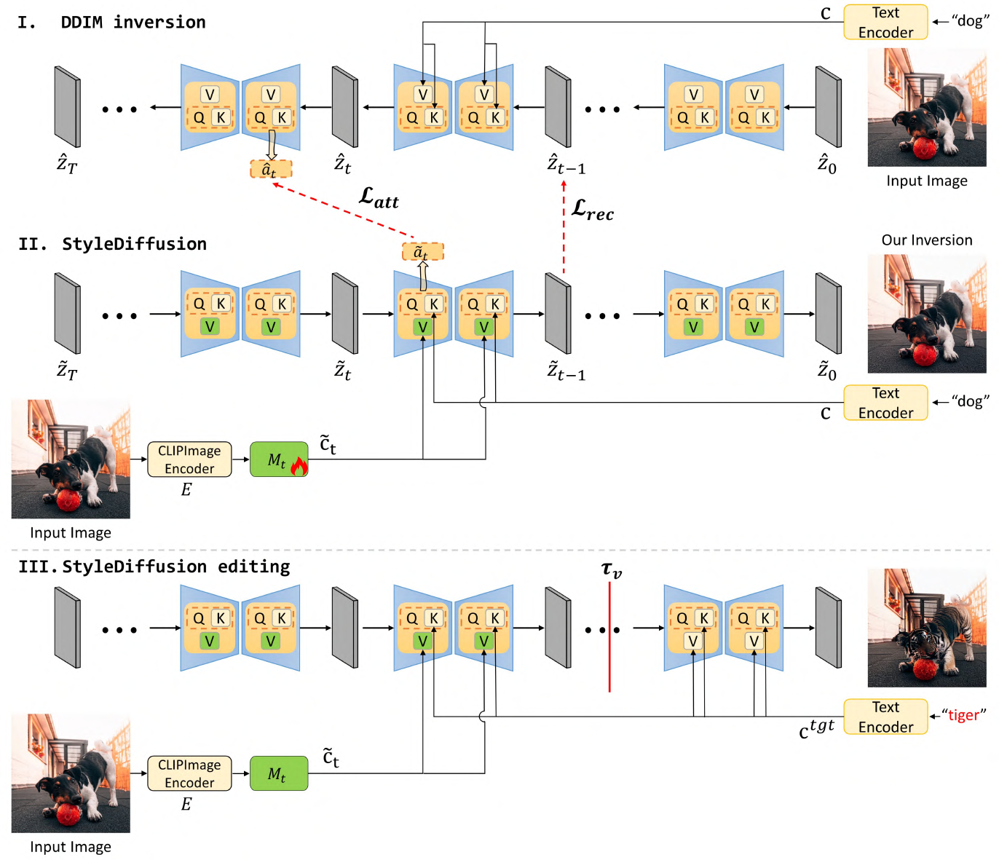

# StyleDiffusion: Prompt-Embedding Inversion for Text-Based Editing (arXiv 2023)
[[arXiv](https://arxiv.org/abs/2303.15649)] [[Github](https://github.com/sen-mao/StyleDiffusion)]
## Datasets 

## Methods 

## Metrics 